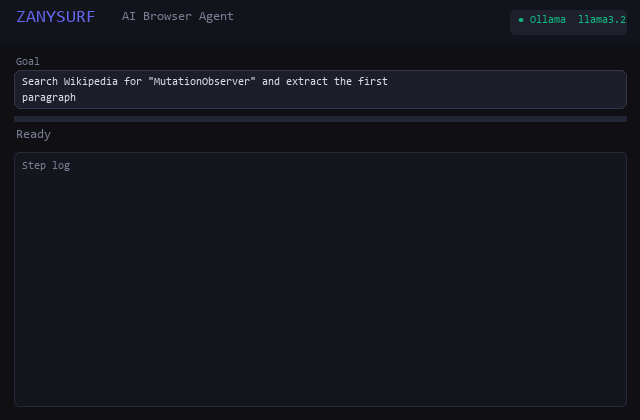

<div align="center">

# ZANYSURF - Autonomous AI Browser Agent

Give it a goal. It does the work.

[](https://developer.chrome.com/docs/extensions/mv3/intro/)
[](https://developer.chrome.com/docs/extensions/)
[](https://microsoftedge.microsoft.com/addons/detail/pmadlohecccigmfcmickngnlikhmnjpa)
[](https://ollama.com)
[](manifest.json)
[](LICENSE)

</div>

ZANYSURF is a Chrome and Edge extension that turns any LLM into a private, autonomous web agent. Type what you want in plain English. It plans, browses, clicks, fills forms, and reports back with full transparency.

If ZANYSURF saves you time, please star the repo.

---

## 🎬 See It In Action



> Demo GIF coming soon — star the repo to get notified!

---

## Highlights

- Summarize YouTube: extract key takeaways from long videos and jump to timestamps.
- All-in-one models: OpenAI, Claude 4, Gemini, Llama, and more (bring your own keys).
- Chat with PDFs and pages: drop PDF, DOC, TXT, or XLS to get answers fast.
- Dive the web: research any site with answers and citations.
- Response faster: set tone and craft emails, replies, or tweets in seconds.
- Monitor prices: track price drops and back-in-stock alerts across marketplaces.
- Automate your work: navigate, extract, click, and fill forms.
- Integrate with 1000+ apps: Make.com and Zapier workflows.
- Record browser macros and replay them instantly.
- REST API surface for external automation and CI/CD pipelines.

---

## Quick Start

Option A - Free, local (recommended)
1. Install Ollama: https://ollama.com
2. Run: `ollama pull llama3.2`
3. Load the `extension/` folder in Chrome or Edge (developer mode)
4. Open the ZANYSURF side panel, select Ollama, type your goal

Option B - Cloud API
1. Load the `extension/` folder
2. Settings -> choose provider -> add API key
3. Type your goal and go

Option C - Edge built-in AI (if available)
1. Load the `extension/` folder in Edge
2. Select Edge Built-in AI

---

## Screenshots

Add screenshots here:

- docs/screenshots/overview.png
- docs/screenshots/agent-run.png
- docs/screenshots/price-compare.png
- docs/screenshots/settings.png

Example usage in README:


See the screenshot placeholder guide: [docs/screenshots/README.md](docs/screenshots/README.md)

---

## Features

Core agent
- Plan-and-execute with reflexion
- Multi-tab orchestration with dependency graphs
- Vision mode for sparse DOM pages
- Safe mode with approval gates
- Local memory and knowledge graph

DOM engine (v2.4.0)
- MutationObserver-based DOM stability detection (replaces polling)
- Shadow DOM and SPA hydration awareness
- React fiber idle check before capturing DOM
- Exponential-backoff retry on transient element failures (stale, detached)
- Stable for 400 ms window before agent reads the page
- Top-level error boundary in content script message handler

Macro Recorder
- Record any sequence of browser actions into a named macro
- Macros are stored locally (100 saved, no cloud)
- Replay a macro on any active tab with a single command
- Delete macros and inspect recorded steps
- Integrate macros into workflows or trigger via REST API

REST API
- External messaging surface via `chrome.runtime.sendMessage`
- Run agent, stop agent, get live status, get metrics
- List and replay workflows and macros
- Read or clear memory context
- Enqueue parallel task batches
- Retrieve audit log and API cost metrics

Automation
- Scheduler for recurring goals
- Workflow replay and audit logs
- CSV export for extracted data

Price comparison
- Auto-open marketplace tabs
- Extract prices per tab
- Synthesize results and export CSV

---

## Macro Recorder

Record any sequence of browser actions and replay them later — no code required.

**Start recording**
1. Open the ZANYSURF side panel
2. Click **Record Macro** (or send `START_MACRO_RECORDING` via the extension API)
3. Perform your actions — clicks, form fills, navigation
4. Click **Stop** to save the macro with a name

**Replay**
- Select a saved macro from the list and click **Replay**
- Or trigger via the REST API: `REPLAY_MACRO` with `{ macroId }`

**Via extension message API**
```js
// Start recording
chrome.runtime.sendMessage(EXTENSION_ID, { action: 'START_MACRO_RECORDING', goal: 'Login flow' });

// Stop and get steps
chrome.runtime.sendMessage(EXTENSION_ID, { action: 'STOP_MACRO_RECORDING' });

// Save
chrome.runtime.sendMessage(EXTENSION_ID, { action: 'SAVE_MACRO', name: 'Login flow' });

// Replay by ID
chrome.runtime.sendMessage(EXTENSION_ID, { action: 'REPLAY_MACRO', macroId: '<id>' });

// List all macros
chrome.runtime.sendMessage(EXTENSION_ID, { action: 'LIST_MACROS' });

// Delete
chrome.runtime.sendMessage(EXTENSION_ID, { action: 'DELETE_MACRO', macroId: '<id>' });
```

---

## REST API

ZANYSURF exposes an external messaging API that any extension (or native messaging bridge) can call.

**Connection**: use `chrome.runtime.sendMessage(ZANYSURF_EXTENSION_ID, { action, ...params })`.

The extension ID must be added to your caller extension's `externally_connectable` and to ZANYSURF's `manifest.json` `externally_connectable.matches`.

| Action | Params | Response |
|---|---|---|
| `RUN_AGENT` | `{ goal }` | `{ success, result }` |
| `STOP_AGENT` | — | `{ success }` |
| `GET_STATUS` | — | `{ active, goal, steps }` |
| `GET_AGENT_METRICS` | — | `{ success, metrics }` |
| `GET_WORKFLOWS` | — | `{ success, workflows[] }` |
| `REPLAY_WORKFLOW` | `{ workflowId }` | `{ success, result }` |
| `GET_MACROS` | — | `{ success, macros[] }` |
| `SAVE_MACRO` | `{ name, steps[] }` | `{ success, macro }` |
| `REPLAY_MACRO` | `{ macroId }` | `{ success, result }` |
| `DELETE_MACRO` | `{ macroId }` | `{ success }` |
| `GET_MEMORY` | `{ query? }` | `{ success, memory[] }` |
| `CLEAR_MEMORY` | — | `{ success }` |
| `ENQUEUE_TASKS` | `{ tasks[] }` | `{ success, queued }` |
| `GET_TASK_STATUS` | — | `{ success, snapshot }` |
| `GET_AUDIT_LOG` | — | `{ success, log[] }` |
| `GET_API_METRICS` | — | `{ success, metrics }` |

**Example — run agent from another extension**
```js
const ZANYSURF_ID = '<extension-id>';
chrome.runtime.sendMessage(ZANYSURF_ID, {
  action: 'RUN_AGENT',
  goal: 'Search for "best espresso machine 2026" and return top 3 results'
}, response => {
  console.log(response.result);
});
```


| Provider | Notes |
|---|---|
| Ollama | Local and private, no server required |
| Gemini | Long context for research tasks |
| OpenAI | General purpose |
| Claude | Strong reasoning |
| Groq | Very fast |
| Mistral | Cost efficient |
| Edge Built-in | Zero-setup on Edge |

---

## Install (Chrome and Edge)

> ⚠️ **API Key Notice:** If using Gemini, your API key is stored in
> `chrome.storage.local`. It never leaves your browser but can be
> accessed via Chrome DevTools. Use a key with usage limits set at
> [Google AI Studio](https://aistudio.google.com).

Chrome
1. Open `chrome://extensions`
2. Enable Developer mode
3. Load unpacked -> select `extension/`

Edge
1. Open `edge://extensions`
2. Enable Developer mode
3. Load unpacked -> select `extension/`

From source
```bash
git clone https://github.com/ZANYANBU/Chrome_Assist_AI.git
cd Chrome_Assist_AI
npm install
npm run build
```

---

## Configuration

Open the ZANYSURF side panel and click the settings icon.

| Setting | Description |
|---|---|
| Provider | Choose Ollama, Gemini, OpenAI, Claude, Groq, Mistral, or Edge Built-in |
| Ollama URL | Default: http://localhost:11434 |
| API Key | Encrypted in the local vault |
| Safe Mode | Require approval for risky actions |
| Memory | Toggle short-term and long-term memory |

---

## Permissions Explained

| Permission | Why it is needed |
|---|---|
| activeTab | Read and interact with the current page |
| scripting | Inject scripts for actions |
| storage | Save settings, memory, and vault |
| alarms | Run scheduled tasks |
| tabs | Multi-tab orchestration |
| downloads | CSV exports |
| sidePanel | Persistent UI in Chrome/Edge |

---

## Architecture (High Level)

Popup and side panel -> Service worker (agent loop) -> Content script (DOM + actions)

Key components:
- LLMGateway: provider routing
- MemorySystem: short/long memory + retrieval
- OrchestratorAgent: multi-agent pipelines
- Risk guards: approvals for critical actions

---

## Changelog

Mar 5, 2026 — v2.4.0
- **DOM fixes**: replaced interval polling with MutationObserver-based `waitForDomStable`. Now detects React/Vue/Angular hydration correctly via shadow DOM observation and React fiber idle check.
- **Stability fixes**: added exponential-backoff retry (200ms/400ms) for transient element failures; top-level try/catch in content script message handler prevents one bad handler from crashing the rest; removed duplicate `sleep` declaration.
- **Macro Recorder**: full record, save, replay, delete pipeline. Steps captured from content script, stored in `chrome.storage.local`, replayed tab-by-tab with proper wait logic.
- **REST API**: expanded `onMessageExternal` with 16 endpoints covering agent control, workflows, macros, memory, tasks, and audit log.

Mar 4, 2026 — v2.1.0
- Added price comparison planning and marketplace search URLs.
- Improved vision-mode click reliability.
- Reduced prompt bloat with context and DOM budgeting.
- Added chat vs task intent detection.

---

## Docs

- Privacy policy: [PRIVACY.md](PRIVACY.md)
- Launch playbook: [docs/LAUNCH.md](docs/LAUNCH.md)
- Changelog: [CHANGELOG.md](CHANGELOG.md)

---

## Repository Structure

```
ZANYSURF/
├── extension/              ← load this folder in Chrome / Edge (developer mode)
│   ├── background.js
│   ├── content.js
│   ├── dom-text-worker.js
│   ├── popup.html / popup.js / popup.css
│   ├── selftest.html / selftest.js
│   ├── manifest.json
│   ├── manifest.edge.json
│   ├── metadata.json
│   └── icons/
├── dev-playground/         ← Vite + React build tooling (NOT the extension)
│   ├── README.md           ← explains this folder
│   └── App.tsx, vite.config.ts, package.json …
├── docs/
│   ├── demo.gif            ← demo screencast (coming soon)
│   ├── LAUNCH.md
│   └── screenshots/
├── qa/                     ← smoke tests and QA reports
├── launch/                 ← store listing and launch assets
├── .github/                ← issue templates and CI workflow
├── .gitignore
├── README.md
├── CHANGELOG.md
├── PRIVACY.md
├── CONTRIBUTING.md
├── PERMISSIONS.md
└── LICENSE
```

---

## Contributing

1. Fork the repo
2. Create a feature branch: `git checkout -b feature/your-feature`
3. Commit: `git commit -m "feat: your feature"`
4. Push and open a Pull Request

---

## License

MIT License - see [LICENSE](LICENSE).

Privacy policy: [PRIVACY.md](PRIVACY.md)
